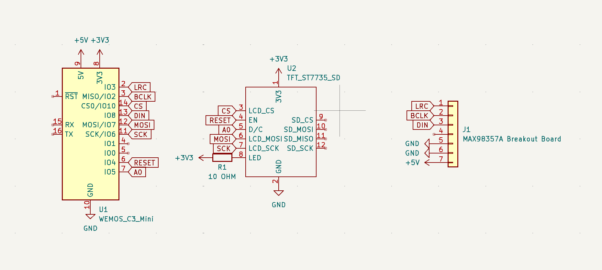

# Aeroportal

Aeroportal is a weather-centered home hub that is designed with simplicity at its core.

The dashboard is hosted at: https://aeroportal.urjith.dev/

# Features

- Weather information
- Time and date
- Alarms
- Broadcast audio messages

# Hardware

## PCB

The PCB is designed in KiCad which is in the `pcb` folder. The electronics consist of a Wemos C3 mini, a TFT display, an I2S amplifier, and a speaker. The PCB is designed to be powered by a USB-C cable connected a wall outlet.

|         Schematic         |         PCB         |
| :-----------------------: | :-----------------: |
|  |  |

- [x] I ran DRC in KiCad and have made sure there are 0 errors!

## Case

The case is designed in Openscad which is in the `cad` folder. To assemble, print the top and bottom parts of the case and assemble them as shown in `cad/assembled.scad`. Glue the holes in the top part to the bottom part to help keep the case together.

It's supposed to look like a lightning bolt, but it I've squeezed it a little due to sizing constraints.

# Software

## Website

The dashboard website is written in Next.js with the Next UI library for the UI components. The website is in the `website` folder. The website is hosted at: https://aeroportal.urjith.dev/.

## Firmware

The firmware is written in Circuitpython and is currently very rudamentary since I do not currently have the hardware to test it. The firmware is in the `firmware` folder. It _should_ be able to connect to the internet, display the weather information on the TFT display, and play scheduled alarms or broadcasted messages (using the API).

- [x] I remembered to exclude any personal information, including API Keys, WiFi passwords, etc

# BOM

Provided by dari // alex:

- 1x WeMos C3 Mini (as a cheaper replacement for the S2) WITHOUT FEMALE HEADERS
- 1x ST7735 1.8" LCD display WITHOUT FEMALE HEADERS. Male headers soldered!

I will be printing my case myself for the additional $10 in my grant.

- 1x Top Half of the Case
- 1x Bottom Half of the Case

I will be sourcing the following parts with my grant:

- 1x PCB from JLCPCB
  - $2 for 5x + $1.50 shipping
- 1x 2.5 Inch 4 Ohm, 3 Watt Speaker [(AliExpress)](https://www.aliexpress.us/item/2251832660654764.html)
  - $3.69 + $1.99 shipping
- 1x MAX98357A I2S Amplifier [(AliExpress)](https://www.aliexpress.us/item/3256805196806369.html)
  - $1.73
- 1x USB-C Cable [(AliExpress)](https://www.aliexpress.us/item/3256806318726664.html)
  - $3.21
- 1x 18 AWG Wire for Speaker [(AliExpress)](https://www.aliexpress.us/item/3256807019333756.html)
  - $8.66
  - Note, this price has been fluctuating a lot (it was around $5 earlier), so I may use a different link if it goes up too much.

Total before tax: $22.78
Total after tax: $24.66

I'll also be source the following parts myself since I already have them and would like to help Hack Club:

- 1x 10 Ohm Resistor
